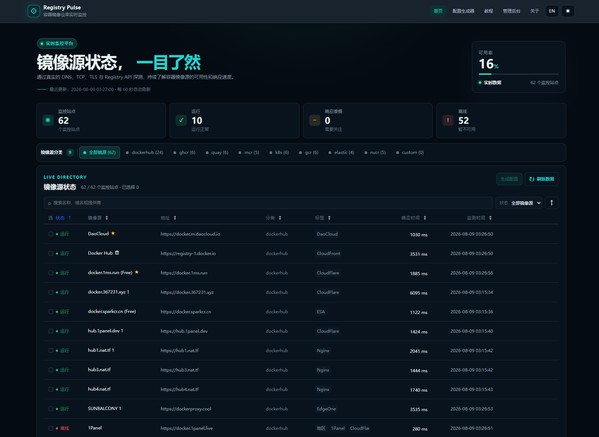
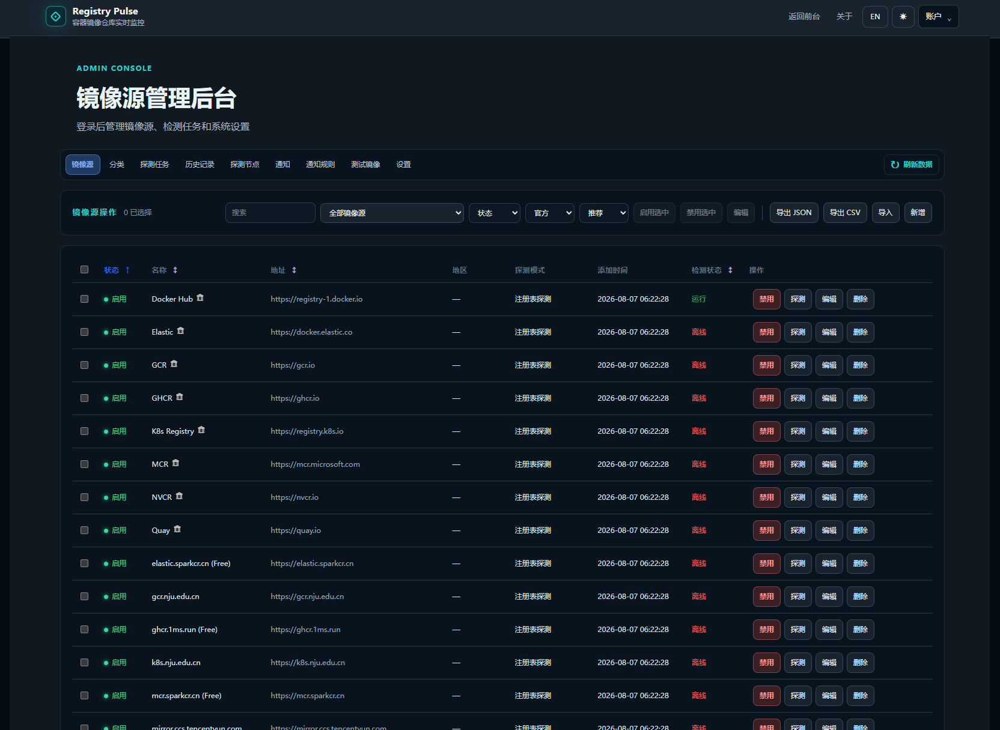

# Registry Pulse

**Registry Pulse** is a real-time monitoring platform for Docker Hub, GHCR, Quay, MCR, Kubernetes Registry, and other OCI/Registry image proxy services.

The project performs real Registry HTTP probes to record source availability, response times, failed stages, and historical results. It also provides a configuration generator and an administration console to help developers and operators select, verify, and maintain container image accelerators.

> The status of a third-party image source only represents the result of the latest probe. It does not guarantee long-term availability or constitute a service commitment.

## Features

- Performs real Registry probes instead of static demos or random mock data
- Supports DNS, TCP, TLS, Registry API, Bearer Token, Manifest, and limited Blob download probes
- Supports Docker Hub, GHCR, Quay, MCR, Kubernetes, GCR, Elastic, NVCR, and custom Registries
- Stores probe results, incidents, and stage-level errors, with detail pages and historical queries
- Configurable normal probe intervals, failure retry intervals, timeouts, concurrency, and state thresholds
- Provides category tabs, search, status filters, sorting, adjustable table headers, and source details
- Generates configurations for Docker daemon.json, Podman, Containerd, and more
- Supports Chinese/English interfaces, light/dark themes, and responsive layouts
- Administration console for sources, categories, tasks, test images, notifications, notification rules, and system settings
- Supports Gotify, Webhook, and SMTP notifications
- Uses PostgreSQL for business data and Redis for caching, scheduling, and task locks
- One-command Docker Compose deployment with independent persistent volumes
- Provides health checks, Prometheus metrics, backup, and restore scripts

## Pages

| Page | URL | Description |
| --- | --- | --- |
| Home | / | Source overview, categories, status statistics, and filters |
| Category | /status/:category | View a specific Registry category |
| Source details | /source/:id | Current status, historical probes, response trends, and incidents |
| Configuration generator | /configure | Generate Docker, Podman, Containerd, and other configurations |
| Tutorial | /tutorial | Docker, Podman, Containerd, and common questions |
| About | /about | Software information, license, and project description |
| Administration | /admin | Manage sources and system features after signing in |

## Architecture

~~~mermaid
flowchart LR
    Browser[Browser] --> Nginx[Nginx]
    Nginx --> Frontend[Vue Frontend]
    Nginx --> API[Go API]
    API --> PostgreSQL[(PostgreSQL)]
    API --> Redis[(Redis)]
    Worker[Go Worker] --> PostgreSQL
    Worker --> Redis
    Worker --> Registry[External Container Registry]
    Agent[Optional Probe Agent] --> API
    Agent --> Registry
~~~

In single-host mode, the API, Worker, frontend, Nginx, PostgreSQL, and Redis run in the same Compose project. Registration, heartbeat, task polling, and result reporting APIs for probe agents are reserved for future multi-region deployments.





## Quick Start

### Requirements

- Docker Desktop or Docker Engine
- Docker Compose v2
- Git
- Windows, Linux, or macOS

### Docker Compose deployment

Linux/macOS:

~~~bash
cp .env.example .env
~~~

Windows PowerShell:

~~~powershell
Copy-Item .env.example .env
~~~

Edit `.env` and at minimum change the administrator password and security keys:

~~~env
ADMIN_USERNAME=admin
ADMIN_PASSWORD=use-a-strong-password
SESSION_SECRET=use-a-random-secret
JWT_SECRET=use-a-random-secret
ENCRYPTION_KEY=use-a-random-secret
CREDENTIAL_ENCRYPTION_KEY=use-a-random-32-byte-secret
~~~

The default port settings are:

~~~env
HTTP_PORT=80
API_HTTP_PORT=8080
~~~

`HTTP_PORT` is the host port exposed by the web-facing Nginx service. `API_HTTP_PORT` is the internal API listening port used by the API service and the Nginx reverse proxy.

Start the services:

~~~bash
docker compose config
docker compose pull
docker compose up -d
docker compose ps
~~~

This release is designed as a fresh installation. On the first API start, the application creates the complete database schema and inserts the default categories, test images, system settings, and built-in source catalog. It does not include legacy migrations, backfills, upgrade, or rollback steps. Restarts skip the completed initialization; keep the PostgreSQL volume and use `make backup` after the service starts. If you intentionally want a blank installation, stop the stack and explicitly remove only this project’s PostgreSQL/Redis volumes; that permanently deletes data.

The application release version is stored in the root `VERSION` file. The Compose variable `REGISTRYPULSE_VERSION=latest` selects the Docker Hub image channel; it is not the version displayed by the application.

Open:

- Frontend: <http://localhost>
- Administration: <http://localhost/admin>

Health checks:

~~~bash
curl -f http://localhost/health
curl -f http://localhost/api/v1/health
curl -f http://localhost/api/v1/public/summary
~~~

Stop the services and view logs:

~~~bash
docker compose down
docker compose logs -f api worker
~~~

## Docker Services and Persistence

The Compose project name is **registrypulse**.

| Service | Purpose |
| --- | --- |
| nginx | Exposes the configured web port and proxies the frontend/API |
| frontend | Builds and serves the Vue static frontend |
| api | Go REST API, authentication, administration, and public queries |
| worker | Schedules probe tasks and stores probe results |
| postgres | Stores sources, tasks, history, incidents, and notification data |
| redis | Caching, task locks, and scheduling coordination |

Persistent volumes:

- registrypulse_postgres-data
- registrypulse_redis-data

Do not run the following command casually, because it deletes the database volumes:

~~~bash
docker compose down -v
~~~

## Image Source Probing

The default flow includes DNS, TCP, TLS, the Registry `/v2/` API, Bearer Token, Manifest, and limited Blob Range downloads.

Recorded data includes total response time, stage durations, HTTP status codes, remote address, Manifest information, Blob time to first byte, download speed, failure stage, last probe time, and incident events.

States include:

- **Running**: Core Registry capabilities are available
- **Slow**: The service is available but response time or download speed has reached a slow threshold
- **Offline**: Probes have failed consecutively or the service is unreachable
- **Maintenance**: Manually set by an administrator and not overwritten by automatic probes
- **Unknown**: Not enough probe results are available yet

Default scheduling settings:

~~~env
PROBE_INTERVAL=30m
PROBE_RETRY_INTERVAL=3m
PROBE_MAX_CONCURRENCY=20
PROBE_TIMEOUT=10s
PROBE_DOWNLOAD_BYTES=2097152
~~~

Normal polling and failure retries are independent. Each normal probe cycle stores one result. Failure retries during the same incident are deduplicated according to state changes to prevent rapid log growth.

### Docker Pull Probe

If the administration console reports:

```text
Probe configuration test failed: docker pull disabled
```

the real Docker Pull probe is not enabled. It is disabled by default:

```env
ENABLE_REAL_DOCKER_PULL=false
```

To enable it explicitly, change `.env`:

```env
ENABLE_REAL_DOCKER_PULL=true
```

The API/Worker containers must also mount the host Docker Engine socket:

```yaml
volumes:
  - /var/run/docker.sock:/var/run/docker.sock
```

For Docker Desktop on Windows, the equivalent mount is commonly:

```yaml
- //var/run/docker.sock:/var/run/docker.sock
```

The Docker Socket grants powerful control over the host Docker Engine. Enable this mode only when that trust boundary is acceptable. For ordinary registry availability checks, use Registry API or Manifest probing instead; they are safer and faster.

## Configuration Generator

Supports Docker daemon.json, 1Panel Docker configuration, Podman registries.conf, Containerd configuration, and image-prefix pull and retag commands.

Docker Hub example:

~~~json
{
  "registry-mirrors": [
    "https://mirror.example.com"
  ]
}
~~~

Non-Docker Hub example:

~~~bash
docker pull ghcr.example.com/user/image:tag
docker tag ghcr.example.com/user/image:tag ghcr.io/user/image:tag
~~~

## Administration and Notifications

The administration console is available at `/admin`. It supports source, category, test image, manual probe, task, history, incident, system settings, password, optional TOTP, import/export, notification, and notification rule management.

Notification channels include Gotify, Webhook, and SMTP Email. Template variables include:

~~~text
{source_name}
{event}
{message}
{status}
~~~

Do not commit administrator passwords, tokens, SMTP passwords, or Webhook secrets to Git in production environments.

### Credential profiles

Credential profiles provide authentication data for registry probes that require access. Three authentication types are available:

| Auth type | Request format | Typical use | Username | Secret |
| --- | --- | --- | --- | --- |
| Basic authentication | `Authorization: Basic ...` | Private registries and enterprise repositories | Registry username | Password or access password |
| Bearer Token | `Authorization: Bearer ...` | GHCR PATs, private registry tokens, and cloud registry tokens | Usually empty | Bearer token or PAT |
| Token | Also sent as Bearer in the current implementation | Generic access tokens or PATs | Usually empty | Access token |

`Bearer Token` and `Token` currently have the same HTTP behavior. The distinction is mainly descriptive; use `Bearer Token` when the registry explicitly documents standard Bearer authentication.

A credential can be matched by:

1. **Registry source**: one exact source, with the highest priority.
2. **Registry host**: all sources using a host such as `ghcr.io` or `registry.example.com`. Enter only the hostname, without `https://`, a path, or `/v2/`.
3. **Registry category**: all sources in a category such as GHCR or MCR.

Matching precedence is:

```text
Exact source > registry host > registry category
```

Examples:

```text
Private registry: Basic authentication, username admin, password as the secret, matched to registry.example.com
GHCR: Bearer Token, leave username empty, use a GitHub Personal Access Token, matched to ghcr.io or the GHCR category
```

Test-image authentication strategy is separate from credential type:

- **Anonymous**: credentials are not required.
- **Optional authentication**: use matching credentials when available, otherwise continue anonymously.
- **Authentication required**: fail authentication when no matching credential exists.

Secrets are encrypted at rest and never returned in plaintext. Production deployments must set a random 32-byte `CREDENTIAL_ENCRYPTION_KEY` and back it up securely.

## API and Observability

The API prefix is `/api/v1`.

~~~text
GET  /api/v1/health
GET  /api/v1/public/summary
GET  /api/v1/public/categories
GET  /api/v1/public/sources
GET  /api/v1/public/sources/{id}
GET  /api/v1/public/sources/{id}/history
GET  /api/v1/public/sources/{id}/incidents
POST /api/v1/public/config-generator/render
POST /api/v1/auth/login
GET  /api/v1/admin/sources
POST /api/v1/admin/sources/{id}/probe
GET  /api/v1/admin/tasks
GET  /api/v1/admin/results
GET  /api/v1/admin/incidents
GET  /api/v1/admin/settings
~~~

Health checks and metrics:

~~~text
GET /health/live
GET /health/ready
GET /metrics
~~~

## Security Design

The project includes Registry URL validation, SSRF protection, DNS redirect validation, Argon2id password hashing, session authentication, login rate limiting, optional TOTP, request IDs, audit logs, sensitive-data redaction, request timeouts, and concurrency limits.

Default security settings:

~~~env
ALLOW_PRIVATE_TARGETS=false
ALLOW_INSECURE_HTTP=false
PUBLIC_API_ENABLED=true
~~~

## Backup, Restore, and Testing

~~~bash
make backup
make restore DIR=backups/YYYY-MM-DD_HH-mm-ss
make test
make test-backend
make test-frontend
make test-e2e
make lint
make validate
make compose-smoke
~~~

Probe tests use local mock services and fixed responses. They do not depend on the real-time availability of third-party image sources.

## Directory Structure

~~~text
RegistryPulse/
├── backend/                 Go API, Worker, Probe Agent, and first-install database schema
├── frontend/src/            Vue pages, components, API, and internationalization
├── deploy/                  Nginx and deployment scripts
├── tests/                   API, Compose, frontend, and E2E tests
├── .env.example             Environment variable template
├── docker-compose.yml       Docker Compose definition
├── Makefile                 Common development commands
├── LICENSE                  AGPL-3.0 license
└── README.md                Project documentation
~~~

## Current Scope and Future Plans

The current version focuses on single-host deployment, real image source probing, status history, configuration generation, the administration console, and notifications.

Future work may include production-grade multi-region probe deployments, dedicated authentication strategies for more Registry providers, historical data aggregation, stronger isolation for container runtime pull probes, fine-grained RBAC, Grafana templates, and more complete OpenAPI clients.

## License

This project is licensed under the [AGPL-3.0](https://www.gnu.org/licenses/agpl-3.0.html) license.

Author:

~~~text
ouoo-code  Registry Pulse
~~~

## Project

GitHub: <https://github.com/ouoo-code/RegistryPulse>

Issues, suggestions, and pull requests are welcome.
